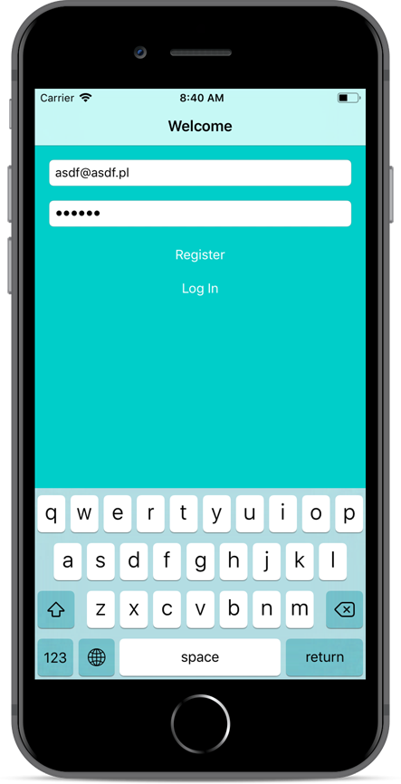
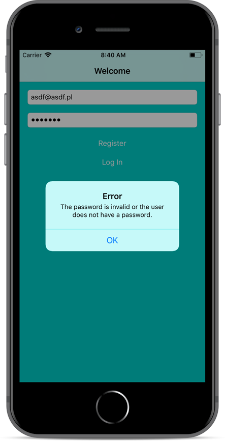
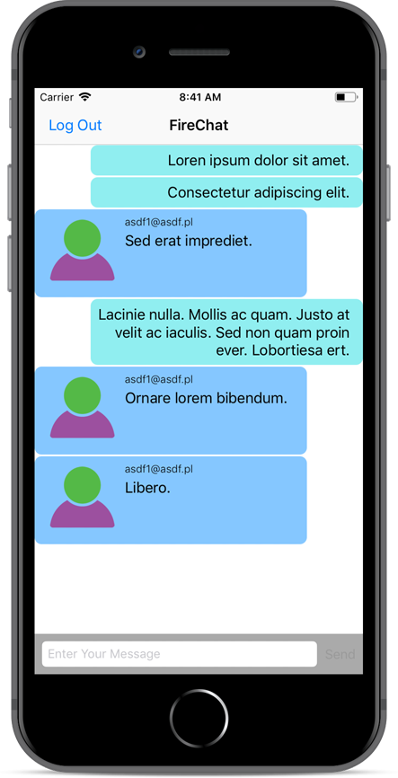
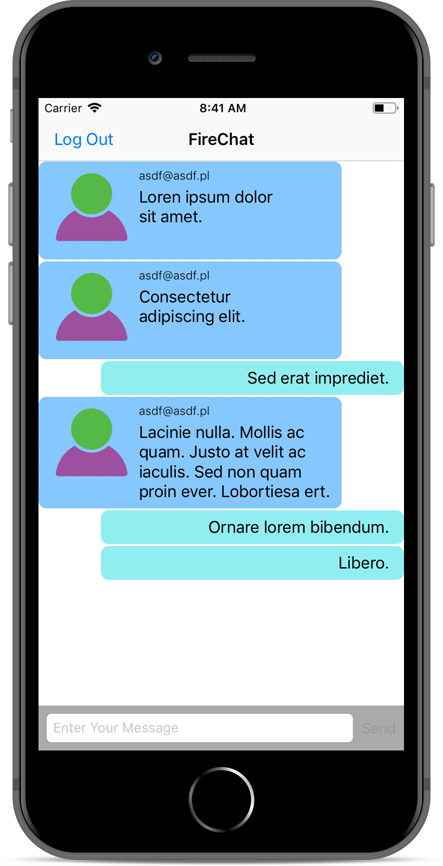
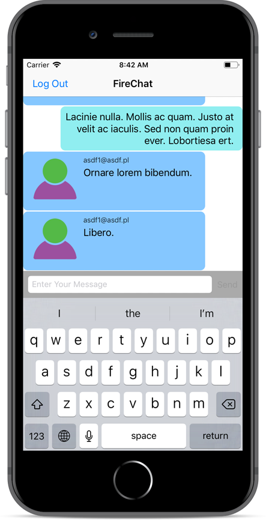
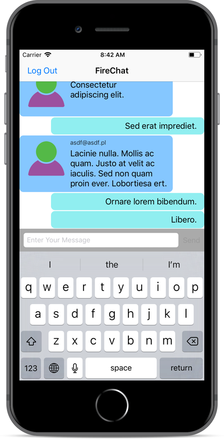

FireChat
---
In FireChat app user creates its own account with email address and a password. While the account is set up chat is available. App uses Firebase to persist data.

* Firebase
* Notification Center
* Table View
* Alert

